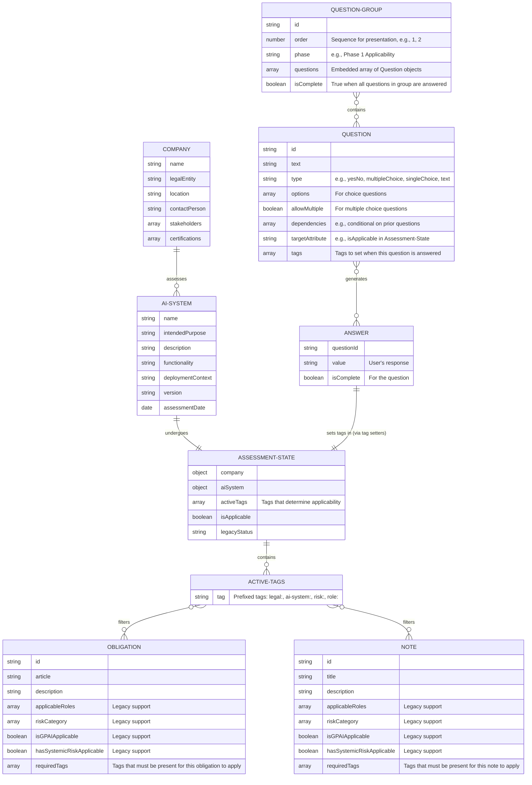
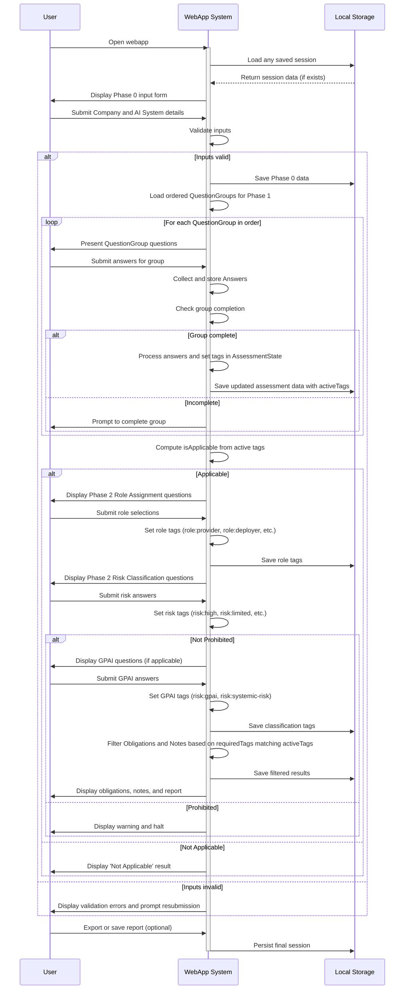

# AI Act Compliance WebApp Domain and Workflow Documentation

## 1. Overview

This document defines the **business domain model**, **data entities**, and **user interaction workflows** for a client- JavaScript web application that guides organizations through Phases 0–2 of the EU AI Act Compliance Journey, culminating in **Obligations Discovery**. It uses a **QuestionGroup** abstraction to automate tag setting in the **Assessment State**, and a wizard-style interface to collect inputs, compute applicability, assign roles, classify risk (including GPAI), and filter applicable obligations and advisory notes using a **tag-based filtering system**.

## 2. Entity-Relationship Model



## 2.1 Entities and Attributes

- **Company**  
    Captures organizational context (Phase 0).  
    Attributes: name, legalEntity, location, contactPerson, stakeholders, certifications.
    
- **AI System**  
    Defines the AI system under review (Phase 0).  
    Attributes: name, intendedPurpose, description, functionality, deploymentContext, version, assessmentDate.
    
- **Assessment State**  
    Determines if the AI Act applies and manages active tags (Phase 1-2).  
    Attributes:
    
    - company (Company)
        
    - aiSystem (AISystem)
        
    - activeTags (string[]) - Tags that determine applicability
        
    - isApplicable (boolean)
        
    - legacyStatus (string)
        
- **Active Tags**  
    Collection of tags that determine which obligations and notes apply.  
    Categories:
    
    - **Legal Scope** (`legal:` prefix): `legal:eu-entity`, `legal:places-on-eu`, `legal:output-in-eu`, `legal:non-professional`, `legal:applicable`
        
    - **AI System Scope** (`ai-system:` prefix): `ai-system:meets-definition`, `ai-system:exempt-military`, `ai-system:exempt-research`, `ai-system:exempt-security`, `ai-system:legacy-system`, `ai-system:exempt`
        
    - **Risk Classification** (`risk:` prefix): `risk:prohibited`, `risk:high`, `risk:limited`, `risk:minimal`, `risk:gpai`, `risk:systemic-risk`
        
    - **Role Assignment** (`role:` prefix): `role:provider`, `role:deployer`, `role:product-manufacturer`, `role:authorized-representative`, `role:importer`, `role:distributor`
    
- **QuestionGroup**  
    Groups related questions for one attribute or logical set.  
    Attributes: id, order, phase, embedded questions, isComplete flag.
    
- **Question**  
    Individual prompt within a group.  
    Attributes: id, text, type, options, allowMultiple, dependencies, targetAttribute, tags.
    
- **Answer**  
    Captures user response.  
    Attributes: questionId, value, isComplete.
    
- **Obligation**  
    Master list of AI Act obligations.  
    Attributes: id, article, description, applicableRoles (legacy), riskCategory (legacy), isGPAIApplicable (legacy), hasSystemicRiskApplicable (legacy), requiredTags.
    
- **Note**  
    Advisory guidance (non-mandatory).  
    Attributes: id, title, description, applicableRoles (legacy), riskCategory (legacy), isGPAIApplicable (legacy), hasSystemicRiskApplicable (legacy), requiredTags.

## 3. User Flow

```mermaid
flowchart TD
    Start[Start: User opens the webapp] --> Phase0[Phase 0: User inputs Company and AI System details e.g., name, purpose, functionality]
    Phase0 --> SysValidate0{System validates inputs Immediate: Checks for completeness}
    SysValidate0 -->|Valid| LoadQG[Load ordered QuestionGroups by phase and order number]
    SysValidate0 -->|Invalid| Phase0
    LoadQG --> Phase1[Phase 1: System presents QuestionGroups in sequence User answers grouped questions for Legal and AI System Scope]
    Phase1 --> SysCollectAnswers{System collects Answers Immediate: Stores responses, checks group completion}
    SysCollectAnswers -->|Group Incomplete| Phase1
    SysCollectAnswers -->|Group Complete| SysSetTags{System sets tags based on answers Immediate: Updates AssessmentState.activeTags}
    SysSetTags --> SysComputeApp{System computes overall applicability Immediate: Based on active tags}
    SysComputeApp -->|Not Applicable| EndNotApp[End: System displays 'Not Applicable' result with advice and no obligations]
    SysComputeApp -->|Applicable| Phase2Role[Phase 2: System prompts Role Assignment questions User selects roles, e.g., Provider, Deployer]
    Phase2Role --> SysAssignTags{System assigns role tags Immediate: Sets role:provider, role:deployer, etc.]
    SysAssignTags --> Phase2Risk[Phase 2: System prompts Risk Classification questions User answers prohibited, high, limited, minimal checks]
    Phase2Risk --> SysClassifyTags{System sets risk tags Immediate: Sets risk:prohibited, risk:high, etc.]
    SysClassifyTags -->|Prohibited| EndProhib[End: System warns 'Prohibited' and halts with report and alternatives]
    SysClassifyTags -->|Other| GPAICheck[Phase 2: System prompts GPAI questions User answers isGPAI and systemic risk]
    GPAICheck --> SysGPATags{System sets GPAI tags Immediate: Sets risk:gpai, risk:systemic-risk]
    SysGPATags --> ObligationDiscovery[Phase 2: System filters Obligations and Notes Immediate: Matches requiredTags with activeTags]
    ObligationDiscovery --> Phase3[Phase 3: System generates Compliance Gap report User reviews gaps, plans; optional export]
    Phase3 --> End[End: System saves session locally Displays full report with obligations, notes, and next steps]
```

## 4. Sequence of Interactions



## 5. Implementation Notes

1. **Storage**: Use `localStorage` to persist `Company`, `AI System`, `Answers`, and assessment state including `activeTags`.
    
2. **QuestionGroup & Tag Setting**: Define each group with an `order` and tag setting logic that reads group answers, computes appropriate tags, and updates the `AssessmentState.activeTags` array.
    
3. **Tag Management**: Implement tag management methods in `AssessmentManager`:
    - `addTag(tag: string)`
    - `removeTag(tag: string)`
    - `hasTag(tag: string): boolean`
    - `getActiveTags(): string[]`
    - `clearTags()`
    - `processQuestionAnswer(questionId, answer, questionType, tags)`
    
4. **Filtering**: After classification, filter the master `Obligation` and `Note` arrays by matching:
    - Primary: `requiredTags.some(tag => activeTags.includes(tag))`
    - Fallback: Legacy filtering (roles, risk levels, GPAI flags) if no `requiredTags` defined
        
5. **UI**: Build a multi-step wizard (e.g., React with conditional rendering) that presents QuestionGroups and phases in sequence, with immediate feedback on validation and computed results.
    
  

## Tag-Based Obligation Matrices

These matrices map obligations from the EU AI Act based on tags. They are derived from Act provisions and can be stored as static JavaScript arrays/objects for client-side lookups. Checkmarks (✓) indicate applicability to roles.

## Matrix 1: Obligations for Minimal/Low-Risk AI Systems

| Article    | Description                                  | Required Tags |
| ---------- | -------------------------------------------- | ------------- |
| Article 4  | AI literacy measures for staff.              | `role:provider`, `role:deployer`, `risk:minimal` |
| Article 50 | Transparency for AI interactions.            | `role:provider`, `role:deployer`, `risk:minimal` |
| Article 49 | Registration in EU database (if applicable). | `role:provider`, `role:authorized-representative`, `risk:minimal` |
| Article 71 | Data entry into EU database.                 | `role:provider`, `role:deployer`, `role:authorized-representative`, `risk:minimal` |

## Matrix 2: Obligations for Limited-Risk AI Systems

| Article    | Description                                            | Required Tags |
| ---------- | ------------------------------------------------------ | ------------- |
| Article 50 | Transparency for emotion recognition, deep fakes, etc. | `role:provider`, `role:deployer`, `risk:limited` |

## Matrix 3: Obligations for High-Risk AI Systems

| Article    | Description                            | Required Tags |
| ---------- | -------------------------------------- | ------------- |
| Article 6  | Classification and documentation.      | `role:provider`, `risk:high` |
| Article 8  | Compliance demonstration.              | `role:provider`, `risk:high` |
| Article 9  | Risk management systems.               | `role:provider`, `risk:high` |
| Article 10 | Data governance.                       | `role:provider`, `risk:high` |
| Article 11 | Technical documentation.               | `role:provider`, `risk:high` |
| Article 12 | Record-keeping logs.                   | `role:provider`, `risk:high` |
| Article 13 | Instructions for use.                  | `role:provider`, `risk:high` |
| Article 14 | Human oversight.                       | `role:provider`, `risk:high` |
| Article 15 | Accuracy, robustness, cybersecurity.   | `role:provider`, `risk:high` |
| Article 16 | General obligations.                   | `role:provider`, `role:product-manufacturer`, `risk:high` |
| Article 17 | Quality management system.             | `role:provider`, `risk:high` |
| Article 20 | Corrective actions.                    | `role:provider`, `risk:high` |
| Article 21 | Cooperation with authorities.          | `role:provider`, `risk:high` |
| Article 22 | Appoint EU representatives.            | `role:provider`, `role:authorized-representative`, `risk:high` |
| Article 23 | Importer compliance checks.            | `role:importer`, `risk:high` |
| Article 24 | Distributor compliance checks.         | `role:distributor`, `risk:high` |
| Article 25 | Value chain responsibilities.          | `role:provider`, `role:deployer`, `role:product-manufacturer`, `role:importer`, `role:distributor`, `risk:high` |
| Article 26 | Deployer measures and oversight.       | `role:deployer`, `risk:high` |
| Article 27 | Fundamental rights impact assessments. | `role:deployer`, `risk:high` |
| Article 41 | Common specifications.                 | `role:provider`, `risk:high` |
| Article 43 | Conformity assessments.                | `role:provider`, `risk:high` |
| Article 47 | EU declaration of conformity.          | `role:provider`, `risk:high` |
| Article 48 | CE marking.                            | `role:provider`, `risk:high` |
| Article 49 | Registration.                          | `role:provider`, `role:deployer`, `role:authorized-representative`, `risk:high` |
| Article 71 | EU database entry.                     | `role:provider`, `role:deployer`, `role:authorized-representative`, `risk:high` |
| Article 72 | Post-market monitoring.                | `role:provider`, `risk:high` |
| Article 73 | Serious incident reporting.            | `role:provider`, `risk:high` |
| Article 86 | Right to explanation.                  | `role:deployer`, `risk:high` |

## Matrix 4: Obligations for GPAI Models (Baseline)

| Article    | Description                 | Required Tags |
| ---------- | --------------------------- | ------------- |
| Article 41 | Common specifications.      | `role:provider`, `risk:gpai` |
| Article 53 | Technical documentation.    | `role:provider`, `risk:gpai` |
| Article 54 | Appoint EU representatives. | `role:authorized-representative`, `risk:gpai` |
| Article 56 | Codes of practice.          | `role:provider`, `risk:gpai` |
| Article 89 | Monitoring and complaints.  | `role:provider`, `risk:gpai` |

## Matrix 5: Obligations for GPAI with Systemic Risk

| Article    | Description                 | Required Tags |
| ---------- | --------------------------- | ------------- |
| Article 51 | Systemic risk classification. | `role:provider`, `risk:gpai`, `risk:systemic-risk` |
| Article 55 | Evaluations, risk mitigation, incident reporting, cybersecurity. | `role:provider`, `risk:gpai`, `risk:systemic-risk` |

For prohibited systems (unacceptable risk), no obligations apply as they are banned; the app should warn and halt.

## User Workflow: Questions for Assessment Records

The app uses wizard-style forms to ask questions, storing answers as assessment records (e.g., JSON objects). Questions are phased and conditional, with automatic tag setting based on answers.

## Phase 1: Applicability Assessment Questions

- Legal Scope:
    
    - Is your organization established in the EU? (Yes/No)
        - Yes → `legal:eu-entity`
        
    - Do you place AI systems on the EU market or use their output in the EU? (Yes/No)
        - Yes → `legal:places-on-eu` or `legal:output-in-eu`
        
    - Are you a natural person using AI for non-professional activities? (Yes/No; if Yes, not applicable)
        - Yes → `legal:non-professional`
        
- AI System Scope:
    
    - Does the system meet the AI definition (e.g., generates outputs like predictions influencing environments)? (Yes/No)
        - Yes → `ai-system:meets-definition`
        
    - Is it exclusively for military, research, or security purposes? (Yes/No; if Yes, exempt)
        - Yes → `ai-system:exempt-military`, `ai-system:exempt-research`, or `ai-system:exempt-security`
        
    - Is it a legacy system without significant changes? (Yes/No; provide details)
        - Yes → `ai-system:legacy-system`
        
- Outcome: Compute isApplicable based on active tags; if not, end with no obligations.
    

## Phase 2: Role Assignment Questions

- Do you develop and place the AI system on the market under your name? (Yes: `role:provider`)
    
- Do you use the AI system under your authority (not personally)? (Yes: `role:deployer`)
    
- Do you import AI from third countries to the EU? (Yes: `role:importer`)
    
- Do you distribute AI in the EU supply chain? (Yes: `role:distributor`)
    
- Are you a product manufacturer integrating AI? (Yes: `role:product-manufacturer`)
    
- Do you represent a non-EU provider? (Yes: `role:authorized-representative`)
    
- Outcome: Populate role tags; entities can have multiple roles.
    

## Phase 2: Risk Classification Questions

- Is the system prohibited (e.g., social scoring, real-time biometric ID in public)? (Yes/No; if Yes, warn and halt)
    - Yes → `risk:prohibited`
    
- Does it qualify as high-risk (e.g., in critical infrastructure, employment, law enforcement)? (Yes/No; list examples)
    - Yes → `risk:high`
    
- Does it involve limited risk (e.g., chatbots, deep fakes)? (Yes/No)
    - Yes → `risk:limited`
    
- If not, classify as minimal/low risk.
    - Default → `risk:minimal`
    
- GPAI Check: Is it a general-purpose AI model? (Yes/No)
    - Yes → `risk:gpai`
    
    - If Yes: Does it exceed 10^25 FLOPs or pose systemic risks? (Yes/No)
        - Yes → `risk:systemic-risk`
        

## Phase 2: Obligation Discovery

- Use active tags to lookup matrices and generate obligation list.
- Filter obligations and notes based on `requiredTags` matching `activeTags`.
    
These questions drive the workflow, creating records for each phase. Store as local objects for reports or exports.

1. [https://digital-strategy.ec.europa.eu/en/policies/regulatory-framework-ai](https://digital-strategy.ec.europa.eu/en/policies/regulatory-framework-ai)
2. [https://securiti.ai/eu-ai-act/assessments/](https://securiti.ai/eu-ai-act/assessments/)
3. [https://artificialintelligenceact.eu/high-level-summary/](https://artificialintelligenceact.eu/high-level-summary/)
4. [https://www.trail-ml.com/blog/eu-ai-act-how-risk-is-classified](https://www.trail-ml.com/blog/eu-ai-act-how-risk-is-classified)
5. [https://ppl-ai-file-upload.s3.amazonaws.com/web/direct-files/attachments/22027641/fd8d068a-1f8f-426a-bb03-5e735a8d7a59/AI-Act-Compliance-Journey.md](https://ppl-ai-file-upload.s3.amazonaws.com/web/direct-files/attachments/22027641/fd8d068a-1f8f-426a-bb03-5e735a8d7a59/AI-Act-Compliance-Journey.md)
6. [https://artificialintelligenceact.eu/assessment/eu-ai-act-compliance-checker/](https://artificialintelligenceact.eu/assessment/eu-ai-act-compliance-checker/)
7. [https://artificialintelligenceact.eu/ai-act-explorer/](https://artificialintelligenceact.eu/ai-act-explorer/)
8. [https://chambers.com/articles/top-10-questions-on-the-eu-ai-act](https://chambers.com/articles/top-10-questions-on-the-eu-ai-act)
9. [https://artificialintelligenceact.eu/article/6/](https://artificialintelligenceact.eu/article/6/)
10. [https://ec.europa.eu/commission/presscorner/detail/en/qanda_21_1683](https://ec.europa.eu/commission/presscorner/detail/en/qanda_21_1683)
11. [https://fpf.org/wp-content/uploads/2023/11/OT-FPF-comformity-assessments-ebook_update2.pdf](https://fpf.org/wp-content/uploads/2023/11/OT-FPF-comformity-assessments-ebook_update2.pdf)
12. [https://www.validaitor.com/post/navigating-the-eu-ai-act-risk-categories-for-ai-systems-how-to-determine-your-obligations](https://www.validaitor.com/post/navigating-the-eu-ai-act-risk-categories-for-ai-systems-how-to-determine-your-obligations)
13. [https://securiti.ai/navigating-general-purpose-ai-models-under-eu-ai-act/](https://securiti.ai/navigating-general-purpose-ai-models-under-eu-ai-act/)
14. [https://digital-client-solutions.hoganlovells.com/ai-act-applicability-assessment](https://digital-client-solutions.hoganlovells.com/ai-act-applicability-assessment)
15. [https://www.iks.fraunhofer.de/content/dam/iks/documents/whitepaper-eu-ai-act-fraunhofer-iks.pdf](https://www.iks.fraunhofer.de/content/dam/iks/documents/whitepaper-eu-ai-act-fraunhofer-iks.pdf)
16. [https://whisperly.ai/eu-ai-act-summary/](https://whisperly.ai/eu-ai-act-summary/)
17. [https://www.europarl.europa.eu/topics/en/article/20230601STO93804/eu-ai-act-first-regulation-on-artificial-intelligence](https://www.europarl.europa.eu/topics/en/article/20230601STO93804/eu-ai-act-first-regulation-on-artificial-intelligence)
18. [https://www.dataguard.com/blog/the-eu-ai-act-and-obligations-for-providers/](https://www.dataguard.com/blog/the-eu-ai-act-and-obligations-for-providers/)
19. [https://dataplatform.cloud.ibm.com/docs/content/svc-watsonxgov/wxgov_assessing_applic.html?context=wx](https://dataplatform.cloud.ibm.com/docs/content/svc-watsonxgov/wxgov_assessing_applic.html?context=wx)
20. [https://www.appliedai.de/en/insights/ai-compliance-navigating-the-eu-ai-act/](https://www.appliedai.de/en/insights/ai-compliance-navigating-the-eu-ai-act/)
21. [https://www.whitecase.com/insight-our-thinking/ai-watch-global-regulatory-tracker-european-union](https://www.whitecase.com/insight-our-thinking/ai-watch-global-regulatory-tracker-european-union)